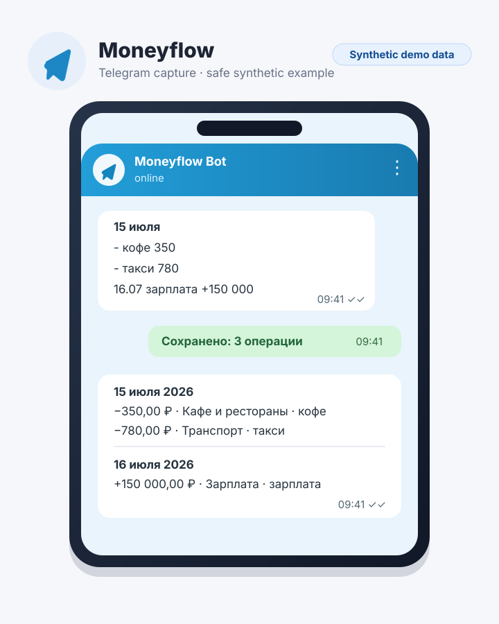
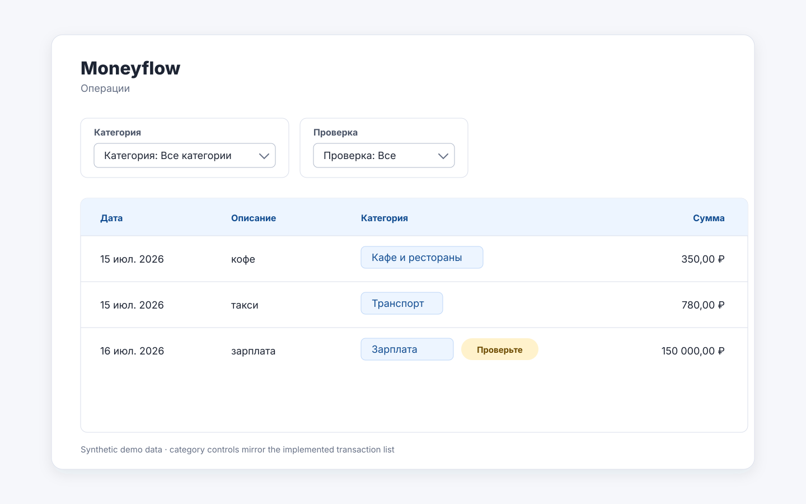
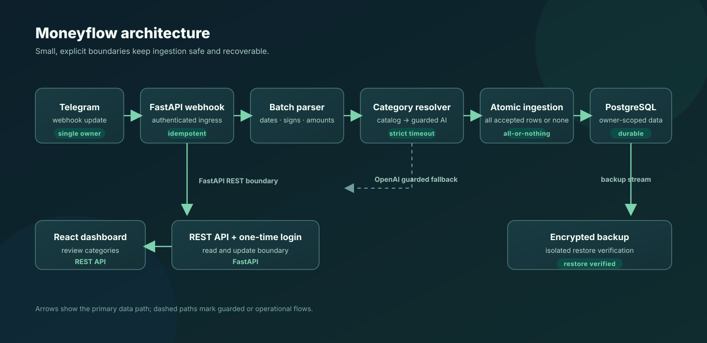

# MoneyFlow

> Capture personal finances in Telegram. Understand them in the browser.

[](https://github.com/floppy522/moneyflow-personal-finance/actions/workflows/ci.yml?query=branch%3Amain)
[](https://github.com/floppy522/moneyflow-personal-finance/releases/tag/v0.1.0)
[](LICENSE)

MoneyFlow is privately deployed. No public demo is exposed because it processes personal financial data; this repository, its tests, and the synthetic previews below are the review surface.

**Product and delivery role:** Valeriy Malov. I owned the problem framing,
requirements, prioritization, technical product decisions, acceptance criteria,
release process, and verification. Implementation was supported by AI coding
agents through specification-driven, test-driven, and review-gated workflows.

## The problem

Personal finance histories become unreliable when recording a purchase takes too much effort. Form-heavy entry creates friction at the moment of spending, while offline notes create a later transcription backlog.

## The solution

MoneyFlow makes Telegram the fast, text-first capture surface and reserves the browser for transaction review and correction. It is a deliberately focused, single-owner product: manual capture first, dependable history before reporting features.

## Product preview

The Telegram flow below uses **synthetic demo data** and depicts implemented multi-line capture with date handling.



The browser flow below also uses **synthetic demo data** and depicts implemented category filtering, review status, and manual correction.



## Implemented

- Manual Telegram capture of expense and income entries.
- Multi-line batch input with date headings, per-line results, and catch-up from notes.
- Automatic category resolution using learned corrections and local rules before an optional guarded OpenAI fallback.
- Idempotent Telegram event handling and atomic batch persistence in PostgreSQL.
- Secure one-time web login, a transaction list, category and review filters, and manual category correction.
- Single-owner enforcement, explicit Alembic migrations, and Docker Compose deployment behind an HTTPS proxy.
- Encrypted backups and isolated restore verification.

## Product decisions

| Decision | Why | Trade-off |
| --- | --- | --- |
| Manual-first | Keeps entry under the owner’s control and avoids bank-integration complexity. | No bank synchronization. |
| Telegram capture, web review | Optimizes one familiar interface for capture and a table for comparison and correction. | Requires a handoff between surfaces. |
| Batch input | Makes offline catch-up practical without repeating a date on every line. | Requires parsing and clear rejected-line feedback. |
| Rules before AI | Uses deterministic, learned behavior first to reduce cost, latency, and non-determinism. | Initial rule coverage is limited. |
| Single-owner design | Keeps the authorization surface small for a private personal product. | No shared household or multi-user workflows. |

For the full product rationale, scope, and decision narrative, read the [product case](docs/product-case.md).

## Architecture



The vertical path is Telegram webhook → FastAPI → batch parser and category resolver → atomic PostgreSQL persistence, with the React dashboard reading and correcting the result through authenticated REST endpoints. The optional provider is a guarded fallback, not the primary category path.

## Technology

| Area | Technology |
| --- | --- |
| API | [FastAPI](apps/api/src/moneyflow/main.py) with [SQLAlchemy and Alembic](apps/api/pyproject.toml) |
| Database | [PostgreSQL](compose.yaml) |
| Telegram | [aiogram](apps/api/pyproject.toml) |
| Categorization | [OpenAI Responses API](apps/api/src/moneyflow/categories/openai_provider.py) |
| Web | [React, TypeScript, and TanStack Query](apps/web/package.json) |
| Edge and delivery | [Caddy](Caddyfile) and [Docker Compose](compose.yaml) |
| Verification | [Pytest, Vitest, and Playwright](.github/workflows/ci.yml) |
| Automation | [GitHub Actions](.github/workflows/ci.yml) |

## Engineering quality

The CI workflow has four focused jobs, without relying on a stale test count:

- **API:** unit and PostgreSQL integration tests, plus Ruff and mypy.
- **Web:** web tests, TypeScript validation, and a production build.
- **End-to-end:** a Playwright vertical slice across capture, review, correction, learning, and one-time login.
- **Release static:** release configuration, shell syntax, Compose, and prohibited-artifact checks.

Key safeguards are implemented as reviewable code and operations:

- [Idempotency](apps/api/src/moneyflow/transactions/repository.py) uses a unique source-event identity and conflict-safe insert behavior.
- [Atomic batch persistence](apps/api/src/moneyflow/telegram/ingestion.py) commits once after processing the batch and rolls back on persistence failure.
- [Secret-safe logging](apps/api/src/moneyflow/logging.py) uses allowlisted structured fields; deployment checks also protect sensitive request and access-log paths.
- [Encrypted backups](ops/backup.sh) are checked by an [isolated restore verification](ops/restore-check.sh) that uses a separate, network-isolated PostgreSQL container.

## Local setup

Prerequisites: Docker with Docker Compose, [uv](https://docs.astral.sh/uv/), and pnpm.

```bash
cp .env.example .env
docker compose up -d db

cd apps/api
uv sync --locked --all-groups
uv run --env-file ../../.env alembic upgrade head
uv run --env-file ../../.env python -m moneyflow.bootstrap
uv run --env-file ../../.env uvicorn moneyflow.main:app --reload
```

In a second terminal:

```bash
cd apps/web
pnpm install --frozen-lockfile
pnpm dev
```

In a separate terminal, verify that the API is healthy:

```bash
curl http://localhost:8000/health
```

The copied `.env` contains example-only Telegram values. Replace `TELEGRAM_BOT_TOKEN`, `TELEGRAM_WEBHOOK_SECRET`, and `AUTHORIZED_TELEGRAM_USER_ID` with your own test values before exercising the Telegram integration. The OpenAI value is optional unless you want to exercise that fallback. [`.env` is ignored](.gitignore) and must never be committed. For production deployment and recovery procedures, see the [operations runbook](ops/deploy.md).

## Current release

The current release is intentionally single-owner, manual-first, RUB-based, and privately deployed. It does not include bank synchronization or public multi-user access.

## Roadmap

Not yet implemented:

- Spending analytics and pie charts
- Monthly and per-category budgets
- Manually valued net worth tracking
- Voice input

## Author

**Valeriy Malov** — Technical Project Manager with product and delivery ownership.

I owned the product problem, requirements, prioritization, technical product decisions, acceptance criteria, and release process. Implementation was completed with AI coding agents through specification-driven, test-driven, and review-gated workflows. I remained accountable for scope, trade-offs, verification, and production readiness.

Read the [full product case](docs/product-case.md) for the product narrative and delivery evidence.

Licensed under the [MIT License](LICENSE).
